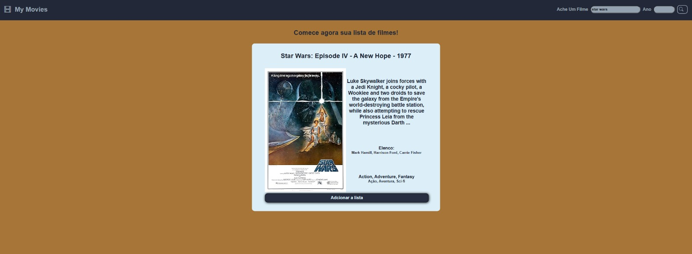
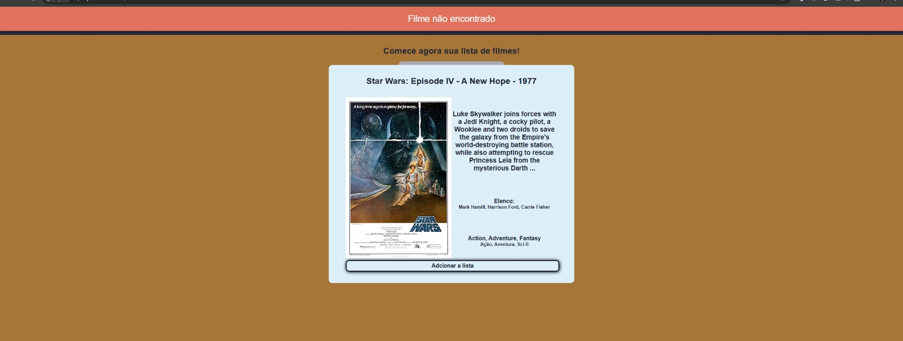
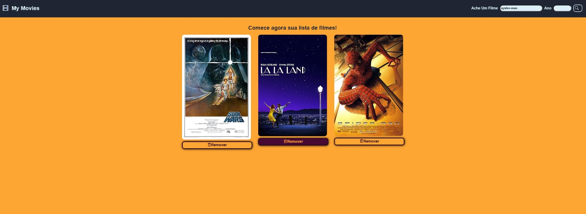

# 🎬 MyFlix - Gerenciador de Filmes (OMDb API) 🍿

## 🌟 Descrição do Projeto
Este projeto web é uma aplicação simples para gerenciamento de filmes, desenvolvida como meu primeiro contato prático com operações CRUD (Create, Read, Update, Delete) e consumo de APIs externas. A aplicação permite aos usuários pesquisar filmes utilizando a OMDb API e gerenciá-los em uma lista de desejos personalizada.

## ✨ Funcionalidades e Demonstração
A seguir, demonstramos as principais funcionalidades do MyFlix com capturas de tela para uma melhor compreensão.

### 🔍 1. Pesquisa e Adição de Filmes ➕
Pesquise seus filmes favoritos pelo título. Se o filme for encontrado, você verá uma prévia com seus detalhes e poderá adicioná-lo à sua lista.

****

*Exemplo: Pesquisando por "Star Wars" e adicionando à lista.*

### 🚫 2. Tratamento de Erro (Filme não Encontrado)
Caso você digite um título incorreto ou o filme não seja encontrado na OMDb API, o sistema exibirá uma mensagem de erro clara.

****

*Exemplo: Buscando por "Spiderman - 1990" (provavelmente um título que não retorna resultado ou está incorreto para a API, resultando na mensagem "Filme não encontrado").*

### 🗑️ 3. Visualização e Remoção da Lista de Desejos
Todos os filmes adicionados são exibidos em sua lista principal. Você pode remover qualquer filme da lista a qualquer momento com um clique.

****

*Exemplo: Lista com três filmes (Star Wars, La La Land, Spider-man) e opção "Remover" visível para cada um.*

---

## 🛠️ Tecnologias Utilizadas
* 📄 **HTML5:** Estruturação semântica do conteúdo.
* 🎨 **CSS3:** Estilização responsiva e interface intuitiva.
* 💡 **JavaScript (ES6+):** Lógica de manipulação do DOM, interatividade do usuário e chamadas assíncronas à API.
* 📡 **OMDb API:** API externa para obtenção de dados de filmes.
